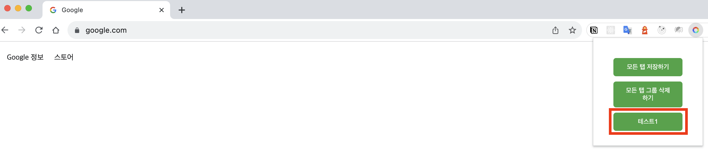

### 목적

콜로소 강의를 들으려고 할 때 크롬이 열려있다면 다음과 같은 메시지가 뜬다

> "녹화 프로그램(크롬 확장프로그램)이 감지되었습니다. 재생을 종료합니다.

그래서 사파리로 들어야하는데, 기존에 크롬을 모두 닫아줘야한다.
물론, 크롬 '방문기록'탭을 통해 기록이 남아있지만, 가끔 닫았던 탭을 다시 찾지 못하는 경우도 발생한다.

 

이 크롬익스텐션은 다음과 같이 사용할 수 있다.

 

### 적용방법

 

 

다운로드를 한 후 크롬을 열어준다.

 

상단 탭에서 빨간 네모 박스 클릭

 

 

클릭 후 압축해제된 파일을 업로드 시켜주기

 

### 사용방법

 

 

테스트 1을 클릭하면 닫혔던 브라우저 탭들이 다시 열림.
